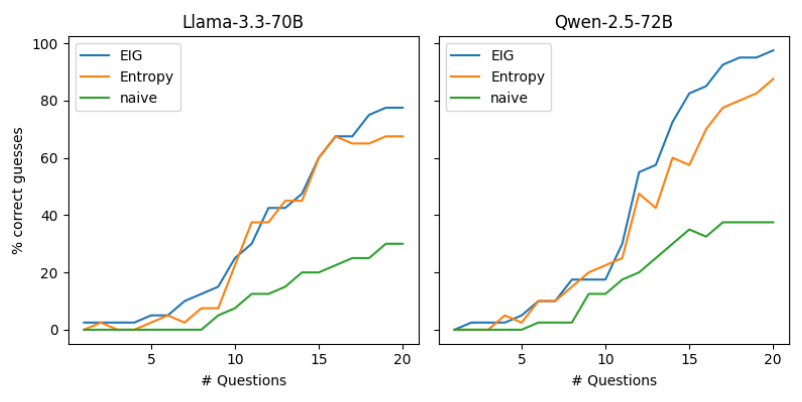

# BED-LLM reproduction

This repository contains a reproduction of the paper "BED-LLM: Intelligent information gathering with LLMs and bayesian experimental design". 
The prompts are tailored to predicting Animals, but can be reused for Celebreties and Things with small adjustments. 
The split-baseline performs a lot worse than indicated in the paper, so there are probably some implementation details missing.
There are currently adapters for LLMs with transformers and vLLM, to add a new one simply extend the Model-class.


## Contents

| File / Directory | Description                                                              |
|------------------|--------------------------------------------------------------------------|
| `config.yml` | Configurable hyperparameters                                             |
| `environment.yml` | Conda configuration file                                                 |
| `model.py` | Interface for LLMs + instantiation using transformers and vLLM           |
| `main.py` | Execute 20 question game and record results                              |
| `questions_game.py` | Outline for the 20 question methods for one given animal                 |
| `generate_candidate_questions.py` | Generate questions for each method (contains MC-EIG/Entropy calculation) |
| `update_beliefs.py` | Update beliefs using a new question–answer pair                          |
| `sample_beliefs.py` | Sample beliefs using greedy decoding                                     |
| `prompts.py` | All prompts used                                                         |
| `helpers.py` | Config setup and small helper functions                                  |
| `plots/` | Results graphically displayed                                            |


## Setup

I currently use conda:
```bash
conda env create -f environment.yml
conda activate 20_questions_env
```
Some dependencies are installed after environment creation:
```bash
pip install accelerate
pip install flash-attn --no-build-isolation
```
If you use HuggingFace models that require authentication (like Llama-3.3-70B-Instruct):
```bash
huggingface-cli login
```
To then run the 20 questions game with hyperparameters as specified in the config.yaml:
```bash
python main.py -c config.yaml
```


## Hardware
I ran the reproduction for Llama-3.3-70B-Instruct and Qwen-2.5-72B-Instruct on 2 A100 GPUs.
Since there are a lot of LLM-calls happening in even a single round, the code takes a long time to run (~2-3min per question). 
I recommend using Qwen-2.5-32B-Instruct: It can run on a single A100 GPU, and the time per question is ~5x faster,
while achieving a solid accuracy of ~70% with the EIG method.

Parameters like `batched_block_size` for parallel computation in the LLM or `gpu_memory_utilization` and `max_model_len` for vLLM are 
specific to my hardware setup.


## Results
My results for the two big open source models used in the paper (in both plots, the questioner and answerer model are the same):



Note that the authors report the results over a single seed, so I did the same here.